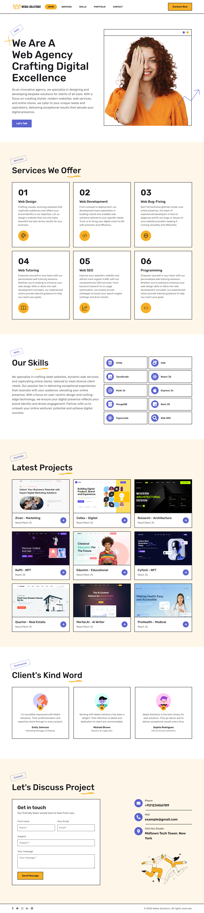

# Webia Solutionz – Modern Digital Agency Website

Webia Solutionz is a professionally built Next.js website styled using pure CSS and SCSS. It’s designed for modern digital agencies and showcases a strong focus on service presentation, portfolio display, and clean user experience.

## 📖 Overview

This project represents a fully custom and original website built for a creative digital agency. The design emphasizes simplicity, professionalism, and real-world client needs — including portfolio previews, services, client testimonials, and a contact form.

## 🙌 Credit
This project was originally developed by Ahad Ali (@ahadalireach).
Modified and extended by @abuzar-alvi with layout adjustments, content additions, and structural improvements.

## ⚙️ Tech Stack

- React.js (with Next.js for routing & SSR)
- CSS & SCSS (no external animation libraries)
- Netlify (for deployment)

## 🚀 Features

### 🖥 Hero Section
- Modern intro with strong branding
- Responsive layout with CTA and visuals

### 🛠 Services We Offer
- Six core service cards:
    - Web Design
    - Web Development
    - Bug Fixing
    - Web Tutoring
    - SEO
    - Programming

### 🧠 Skills Section
- Technologies listed with minimal icon-based layout:
    - HTML, CSS, JavaScript, React.js, Next.js, Node.js, Express.js, MongoDB, TypeScript, Web SEO

### 📂 Portfolio (Latest Projects)
- Nine showcased projects from different industries like:
    - Marketing, Education, NFT, Medical, Real Estate, AI Tools

### 💬 Client Testimonials
- Short and sweet quotes from satisfied clients with avatars

### 📞 Contact Section
- Fully functional contact form
- Company details including phone, email, and location

## 📄 License
> This project is open source under the MIT License.
Designed by @ahadalireach, refined by @abuzar-alvi.
